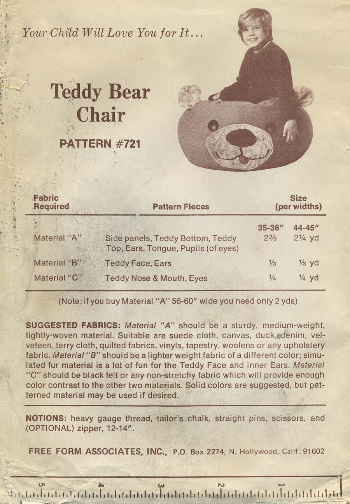
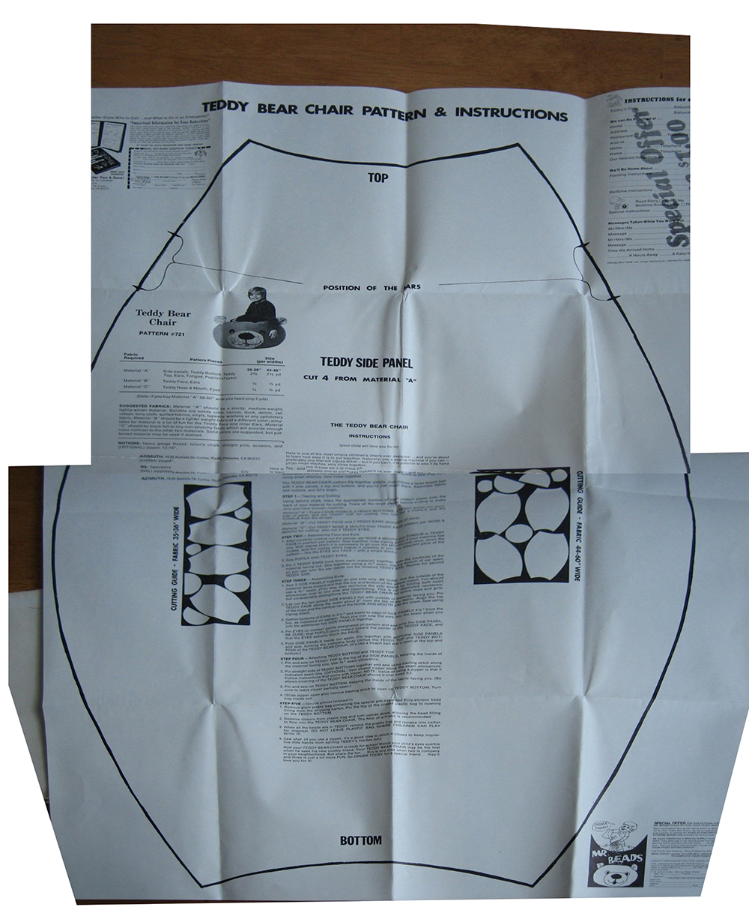

# Teddy Bear Chair

## A recreation of a 1970s-era bean bag chair sewing pattern

My mom had fairly serviceable 70s homemaker skills.  She could decorate a mean cake and was pretty decent with a sewing machine that I myself now have!

My own wife's is much more fun and when I learned in the back of my mind many years ago was the idea that I would be able to re-create this pattern from my childhood.  Despite the modern marketplace saving everything discovered since 2006 this pattern turns out to be super-rare and unfindable.

My mom had of course downsized by the time I took up sewing and had downsized the pattern likely into oblivion though things shake out from time to time.  In 2017 I discovered [a photo of the pattern envelope on pinterest](https://www.pinterest.com/pin/226868899952097800).

  It *did* exist!  One!  In all the years and obscure searches.  Despite now having several great inroads such as the manufacturer and the name it would not be until early 2019 that I would discover that I had missed by a month on either side [a listing on etsy](https://www.etsy.com/listing/159444967/teddy-bear-chair-mail-order-pattern-721
) -- already closed!

I wasn't entirely heartbroken however as the listing had serviceable pattern images that could be kludged over in Photoshop before trying to make some sense
of things in Illustrator. :D

I super-love Open Source software but my legacy copy of CS6 continues to be a rock-solid performer.

## To-dos
* My pagination was quick and with the intention to Get It Out.  Mistakes Were Made WRT the auto-pagination making a really cute paste-up recreation of the OG layout but an absolutely inconsiderate and awful paste-up-and-use-the-tiny-corner. 
* I thumb-measured the sheet size off a standard envelope size and the number of folds.  I have since found out that full-page printers exist who print lovely patterns for not that expensive.  The main layout should be refactored for this.
* Gosh but PDFs of the above for common consumption would be nice.
* 1970s layout is cute but there are a number of things I would arrange a little differently by way of instruction and illustration.  I'm not sure what sort of dry-transfer-and-tape the original was created in but it was wonderful
to marvel at it and be so much happier with my applied styles and nudge tools.

# Sources

Published as "Teddy Bear Chair/Pattern 721"

Original pattern by:
>Free Form Associates Inc  
>P.O. Box 2274  
>N. Hollywood, Calif 91602

Also published by:
>AZIMUTH  
>Avenida De Cortez  
>Pacific Palisades, CA 90272

# Printers
* https://www.pdfplotting.com/product/bw-pattern-printing/

